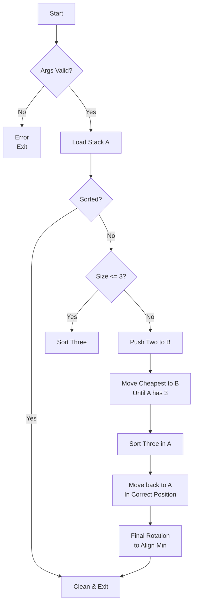

# Push_swap

*This project was created as part of the 42 curriculum by rafael-m.*


## Description
`push_swap` is a highly efficient C project focused on algorithmic optimization. The goal is simple: sort a stack of integers using a second auxiliary stack and a limited set of operations, aiming for the absolute minimum number of moves.

This implementation utilizes a **Greedy Cost-Based Algorithm** (often referred to as the "Turk Algorithm"), which calculates the mechanical cost of every possible move to select the most efficient one at each step.

## Instructions

### Compilation
The project uses a robust `Makefile` with standard 42 rules.
```bash
make        # Compiles the push_swap binary
make debug  # Compiles with AddressSanitizer and debug symbols
make fclean # Removes all binaries and object files
```

### Execution
Provide a list of unique integers as arguments. The program outputs the sequence of instructions to sort them.
```bash
./push_swap 5 2 8 1 9
```

To verify the move count:
```bash
ARG="5 2 8 1 9"; ./push_swap $ARG | wc -l
```

## Structures & Algorithms

### The Turk Algorithm (Greedy Cost-Based)
Instead of using fixed chunks or simple pivots, this implementation evaluates the **cost** of moving each element from Stack A to its correct relative position in Stack B.
- **Cost Calculation**: It accounts for the number of rotations needed for both the element in A and its target in B.
- **Simultaneous Rotations**: The algorithm prioritizes moves where `rr` (rotate both) or `rrr` (reverse rotate both) can be used to reduce the total operation count.
- **Efficiency**: Achieves ~500-600 moves for 100 random numbers and ~5000-5500 for 500 numbers, comfortably passing 42's high-performance benchmarks.

### Data Structures
- **Circular Linked List**: Built upon a modified `libft` list structure.
- **Direct Pointer Storage**: Optimized memory by storing integer values directly in `void *` pointers to avoid redundant heap allocations for every node's content.

### Execution Flow


## Resources
- [The "Turk Algorithm" Concept](https://medium.com/@ayogun/push-swap-c1f5d2d41e97)
- [42 School Norminette V4](https://github.com/42School/norminette)

### AI Usage
This project was refined and audited using the **Gemini CLI**. AI assistance was specifically utilized for:
- **Algorithmic Refinement**: Optimizing the `ft_calculate_cost` function to precisely account for simultaneous rotations (`rr`/`rrr`).
- **Memory Auditing**: Identifying and fixing memory leaks in error paths and optimizing the node storage strategy.
- **Safety Hardening**: Implementing robust argument validation to handle edge cases like integer overflows and complex string inputs.

---

### Key Features
- **Zero Memory Leaks**: Verified with AddressSanitizer and Valgrind.
- **High Performance**: Well below the move limits for both 100 and 500 number benchmarks.
- **Error Resilience**: Handles invalid characters, duplicates, and overflows with standard-compliant error messaging.
